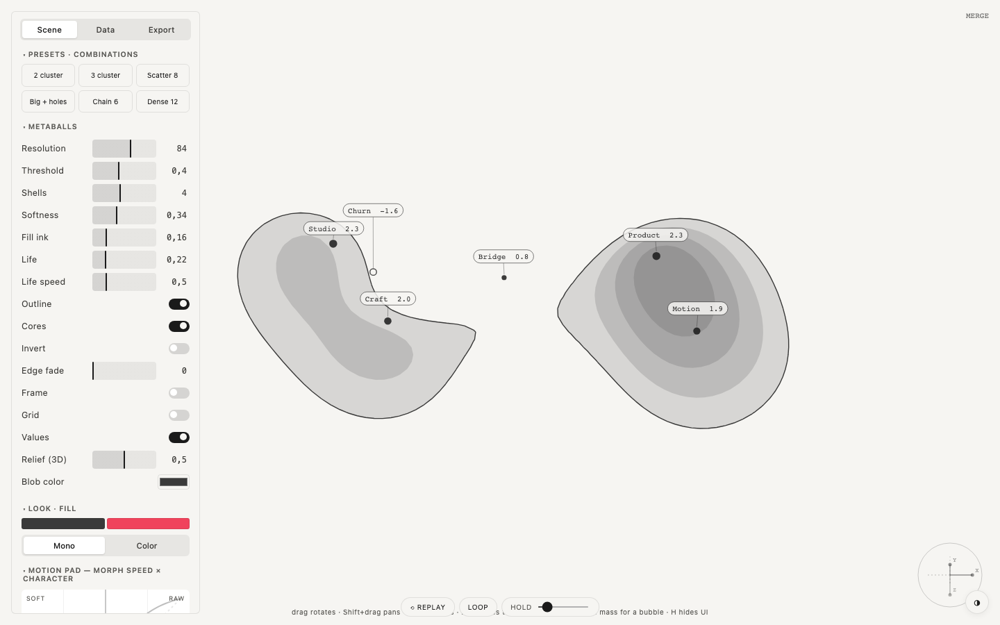

  

<h1 align="center">Metaballs</h1>

  Soft masses that merge, split and leave holes 
  one HTML file · runs in the browser · no install · free and open source

  <a href="https://robvagin.github.io/metaballs/"><b>Open Metaballs</b></a> ·
  <a href="#run-it">Run it</a> ·
  <a href="#more-tools">More tools</a>

---

Drops of a field: close masses melt into one shape, negative ones eat holes into it, and with Life switched on the whole thing breathes.

## What it does

- **Masses** with a weight (plus is a drop, minus is a hole) and a radius of influence
- **Presets:** 2 cluster, 3 cluster, big with holes, chain of 6, dense 12, scatter 8
- **Life** keeps joining and splitting the clusters; a click on a mass opens its note
- **Look:** mono or color fill, outline, cores, relief, grid and values
- **Export:** PNG, SVG and a JSON config

## Run it

Open [robvagin.github.io/metaballs](https://robvagin.github.io/metaballs/), or download `index.html` and open it from your disk. It is the whole tool: no build step, no dependencies, no network. Press **H** to hide the panel.

## Made by a designer

I'm a designer. I build small tools like this for my own work, with AI agents: I make the decisions, Claude Code writes the code. The panels follow one grammar across the whole set.

Take it if you want it.

## More tools

- [Particle Dance](https://github.com/robvagin/particle-dance) · particles that dance along patterns and 3D forms
- [Murmur](https://github.com/robvagin/murmur-vj) · a VJ visualizer: circles, triangles and squares that move to your music
- [Orbital](https://github.com/robvagin/orbital) · data as orbits, axes or a bending mesh
- [Halftone Cloud](https://github.com/robvagin/halftone-cloud) · images rebuilt as a halftone of flying shapes
- [Logomachine](https://github.com/robvagin/logomachine) · seeded generative marks: one seed, one pattern, always
- [Motion Primer](https://github.com/robvagin/motion-primer) · bodies with behaviors: swarm, pack, magnet, orbit, fall, scatter
- [Particles 3D](https://github.com/robvagin/particles-3d) · a WebGL2 cloud of up to 300,000 particles
- [Guilloche](https://github.com/robvagin/guilloche) · guilloche line work: rosettes, weaves, tori and Chladni figures
- [Unison](https://github.com/robvagin/unison) · metronomes on one board falling into unison
- [Pixel Ring](https://github.com/robvagin/pixel-ring) · rings drawn in pixels
- [Motion Pad](https://github.com/robvagin/motion-pad) · one pad for the character of motion

## License

[MIT](LICENSE) © 2026 Robert Vagin
